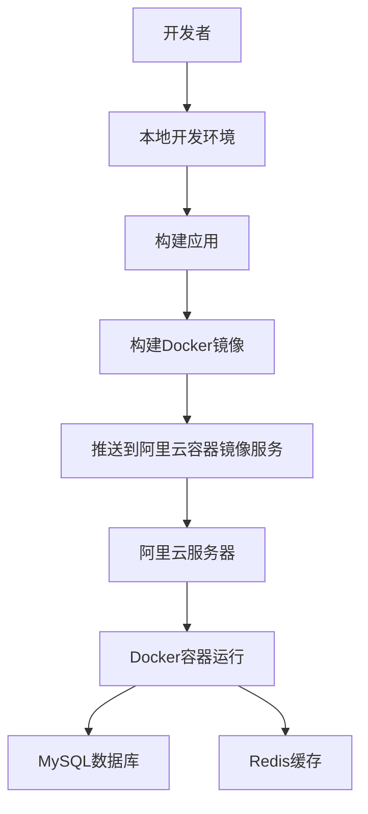

# NestJS 项目部署指南

本指南详细介绍如何将 NestJS 项目打包并部署到阿里云服务器，并实现流程化部署。

## 部署架构



## 1. 环境准备

### 1.1 本地环境
- Node.js 18+
- npm/pnpm
- Docker
- Git

### 1.2 阿里云环境
- 云服务器 ECS (CentOS 7+/Ubuntu 20.04+)
- 容器镜像服务 ACR
- 安全组配置（开放端口 3012、3306、6379）

## 2. 配置要求

### 2.1 环境变量配置

在项目根目录创建 `.env` 文件，配置以下环境变量：

```env
# 应用配置
APP_PORT=3012
APP_GLOBAL_PREFIX=api
APP_CORS=true

# 数据库配置
DATABASE_HOST=mysql
DATABASE_PORT=3306
DATABASE_USERNAME=root
DATABASE_PASSWORD=123456
DATABASE_DATABASE=nest_db
DATABASE_SYNCHRONIZE=false
DATABASE_LOGGING=false

# Redis配置
REDIS_HOST=redis
REDIS_PORT=6379
REDIS_PASSWORD=

# 机器ID（用于生成唯一ID）
MACHINE_ID=170
```

### 2.2 阿里云容器镜像服务配置

1. 登录阿里云控制台，开通容器镜像服务
2. 创建命名空间（如：`your-namespace`）
3. 创建镜像仓库（如：`nest-service`）

## 3. 手动部署步骤

### 3.1 本地构建

```bash
# 安装依赖
pnpm install

# 构建项目
pnpm run build

# 构建Docker镜像
docker build -t registry.cn-hangzhou.aliyuncs.com/your-namespace/nest-service:latest .

# 登录阿里云容器镜像服务
docker login registry.cn-hangzhou.aliyuncs.com

# 推送镜像
docker push registry.cn-hangzhou.aliyuncs.com/your-namespace/nest-service:latest
```

### 3.2 服务器部署

1. 连接服务器
```bash
ssh root@your-server-ip
```

2. 安装Docker和Docker Compose
```bash
# CentOS
yum install -y docker
curl -L "https://github.com/docker/compose/releases/latest/download/docker-compose-$(uname -s)-$(uname -m)" -o /usr/local/bin/docker-compose
chmod +x /usr/local/bin/docker-compose

# 启动Docker
systemctl start docker
systemctl enable docker
```

3. 创建部署目录
```bash
mkdir -p /opt/nest-service
cd /opt/nest-service
```

4. 复制配置文件
```bash
# 从本地复制或直接创建
# scp docker-compose.prod.yml root@your-server-ip:/opt/nest-service/
# scp .env root@your-server-ip:/opt/nest-service/
```

5. 运行容器
```bash
docker-compose -f docker-compose.prod.yml up -d
```

## 4. 自动化部署

### 4.1 使用部署脚本

项目中已提供自动化部署脚本 `deploy.sh`，使用方法：

1. 配置脚本中的变量
```bash
# 编辑deploy.sh，修改以下变量
IMAGE_NAME="registry.cn-hangzhou.aliyuncs.com/your-namespace/nest-service"
SERVER_IP="47.93.63.238"
SERVER_USER="root"
```

2. 执行部署
```bash
./deploy.sh
```

### 4.2 CI/CD集成

可以集成GitHub Actions或Jenkins实现自动部署：

#### GitHub Actions示例（.github/workflows/deploy.yml）

```yaml
name: Deploy to Aliyun

on:
  push:
    branches: [ main ]

jobs:
  deploy:
    runs-on: ubuntu-latest
    steps:
      - uses: actions/checkout@v3
      
      - name: Set up Node.js
        uses: actions/setup-node@v3
        with:
          node-version: '18'
      
      - name: Install pnpm
        run: npm install -g pnpm
      
      - name: Install dependencies
        run: pnpm install
      
      - name: Build project
        run: pnpm run build
      
      - name: Login to Aliyun Container Registry
        run: echo ${{ secrets.ALIYUN_DOCKER_PASSWORD }} | docker login registry.cn-hangzhou.aliyuncs.com -u ${{ secrets.ALIYUN_DOCKER_USERNAME }} --password-stdin
      
      - name: Build and push Docker image
        run: |
          docker build -t registry.cn-hangzhou.aliyuncs.com/your-namespace/nest-service:latest .
          docker push registry.cn-hangzhou.aliyuncs.com/your-namespace/nest-service:latest
      
      - name: Deploy to server
        uses: appleboy/ssh-action@master
        with:
          host: ${{ secrets.SERVER_IP }}
          username: ${{ secrets.SERVER_USERNAME }}
          key: ${{ secrets.SERVER_PRIVATE_KEY }}
          script: |
            cd /opt/nest-service
            docker-compose -f docker-compose.prod.yml down
            docker-compose -f docker-compose.prod.yml up -d
```

## 5. 部署后管理

### 5.1 查看容器状态
```bash
docker-compose -f docker-compose.prod.yml ps
```

### 5.2 查看应用日志
```bash
docker-compose -f docker-compose.prod.yml logs -f
```

### 5.3 重启应用
```bash
docker-compose -f docker-compose.prod.yml restart app
```

### 5.4 备份数据库
```bash
docker-compose -f docker-compose.prod.yml exec mysql mysqldump -u root -p nest_db > nest_db_backup.sql
```

## 6. 性能优化

### 6.1 数据库优化
- 定期清理无效数据
- 对频繁查询的字段建立索引
- 配置合理的连接池大小

### 6.2 应用优化
- 启用Redis缓存
- 配置Node.js内存限制
- 使用PM2管理Node进程（可选）

## 7. 常见问题排查

### 7.1 应用启动失败
- 检查环境变量配置
- 查看容器日志：`docker-compose -f docker-compose.prod.yml logs app`
- 确认数据库连接正常

### 7.2 数据库连接失败
- 检查MySQL服务状态
- 验证数据库用户名和密码
- 确认数据库是否已创建

### 7.3 文件上传问题
- 检查uploads目录权限
- 验证磁盘空间是否充足
- 检查Nginx配置（如果使用反向代理）

## 8. 安全建议

- 定期更新依赖包
- 修改默认密码
- 使用HTTPS
- 配置防火墙规则
- 限制数据库远程访问

---

部署完成后，应用将在 `http://your-server-ip:3012/api` 访问。